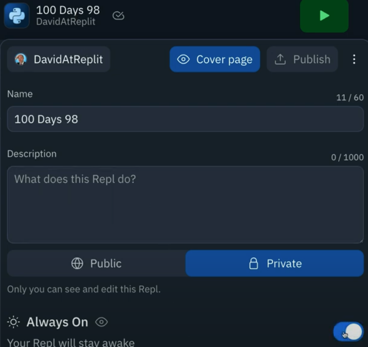
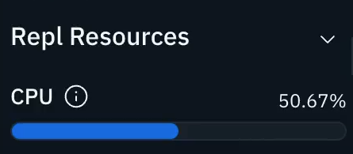

# Automate! Automate!

We are so close. I can taste it, folks! Massive kudos on getting this far!

Today's lesson, however, will work best if you have one of Replit's paid for features (hacker plan or cycles).  

Free plan Repls 'fall asleep' after a while. Automation kinda relies on the Repl being always on.

If you have [hacker plan](https://replit.com/pricing) or you've bought some [cycles](https://replit.com/pricing), then you can enable always on in the drop down menu that appears when you click your Repl name (top left). 



This is important because when our repl is always running, it can keep track of time and schedule events.
##
👉 I've set up a simple schedule that prints out a clock emoji every couple of seconds. It works like this:

- Import `schedule` library
- Create a simple subroutine that outputs the emoji.
- Schedule the subroutine to run every 2 seconds with `schedule.every(2).seconds.do(printMe)`
- Create an infinite loop that repeats `schedule.run_pending()` - this means _run any tasks in the schedule_.

```python
import schedule

def printMe():
  print("⏰")

schedule.every(2).seconds.do(printMe)

while True:
  schedule.run_pending()
```
This is great and everything, but it's a HUGE resource hog - look at the CPU indicator in the 'Repl Resources' pane!  It's running that `while True` loop thousands (millions?) of times a second to check if there's anything in the schedule.



A quick hack for this is to put a little `time.sleep()` to make the loop run once per second instead.  Here's the code:
```python
import schedule, time # Import the time library

def printMe():
  print("⏰")

schedule.every(2).seconds.do(printMe)

while True:
  schedule.run_pending()
  time.sleep(1) # Pause for 1 second before moving on
```

What if we wanted to run something every few minutes instead?  Easy peasy!

```python
schedule.every(2).minutes.do(printMe)
```

Hours? Of course!

```python
schedule.every(2).hours.do(printMe)
```

So let's think of something cool to do every hour.

### How about we send ourselves a very lovely email to remind ourselves to take a little break.
