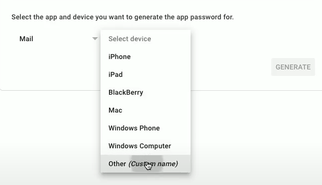

# Email? How Quaint.

You will need an email account for this. I'm using GMail and generating a one time password. Gmail users can do this in the security settings for your google account (generate an **app password**). Other mail services may let you use your regular password, but Gmail has this extra security layer.
##
In Gmail, choose 'Mail App' and 'Other' (call it 'Replit').



👉 Copy the app password and set it as a Repl secret called **mailPassword**.

👉 Add another secret **mailUsername** and set it to your email address.

👉 Import `os` and add your secrets to the code:

```python
import schedule, time, os

password = os.environ['mailPassword']
username = os.environ['mailUsername']

def printMe():
  print("⏰")

schedule.every(2).seconds.do(printMe)

while True:
  schedule.run_pending()
  time.sleep(1)
```
## Set up the mail
👉 Now we can set up the mail.  

There is a LOT going on here, so I've commented all of the new code.

*TLDR: New imports. New subroutine to set all the mail parameters. Create the mail & send it. Call the subroutine to test it.*

```python
import schedule, time, os, smtplib # Import the smtp library
from email.mime.multipart import MIMEMultipart # Import the mime library to create multipart messages
from email.mime.text import MIMEText # Import the mime library to create text messages

password = os.environ['mailPassword']
username = os.environ['mailUsername']

def sendMail():
  email = "Don't forget to take a break!" # Contents of the message
  server = "smtp.gmail.com" # Address of the mail server, change it to yours if you need to
  port = 587 # Port of the mail server, change it to yours if you need to
  s = smtplib.SMTP(host = server, port = port) # Creates the server connection using the host and port details
  s.starttls() # Sets the encryption mode
  s.login(username, password) # Logs into the email server for us

  msg = MIMEMultipart() # Creates the message
  msg['To'] = "recipient@email.com" # Sets the receiver's email address
  msg['From'] = username # Sets the sender's email address
  msg['Subject'] = "Take a BREAK" # Sets the subject of the message
  msg.attach(MIMEText(email, 'html')) # Attaches the email content to the message as html

  s.send_message(msg) # Sends the message
  del msg # Deletes the message from memory

sendMail() # Call the subroutine to test it.

def printMe():
  print("⏰")

schedule.every(2).seconds.do(printMe)

while True:
  schedule.run_pending()
  time.sleep(1)
```
## Schedule it
👉 Now let's schedule it to send every hour:

```python
import schedule, time, os, smtplib 
from email.mime.multipart import MIMEMultipart 
from email.mime.text import MIMEText 

password = os.environ['mailPassword']
username = os.environ['mailUsername']

def sendMail():
  email = "Don't forget to take a break!" 
  server = "smtp.gmail.com" 
  port = 587 
  s = smtplib.SMTP(host = server, port = port) 
  s.starttls() 
  s.login(username, password) 

  msg = MIMEMultipart() 
  msg['To'] = "recipient@email.com" 
  msg['From'] = username 
  msg['Subject'] = "Take a BREAK" 
  msg.attach(MIMEText(email, 'html'))

  s.send_message(msg) 
  del msg 


def printMe():
  print("⏰ Sending Reminder")
  sendMail() # Moved the subroutine into printMe which is already scheduled

schedule.every(1).hours.do(printMe) # Changed the interval to every 1 hour

while True:
  schedule.run_pending()
  time.sleep(1)
```


## Try it out!